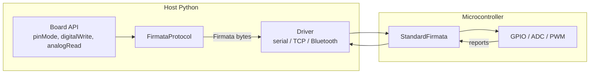

<div align="center">

# liveduino

### A live Python REPL for your board: type a command, watch the hardware react instantly.

[](https://www.python.org/)
[](https://docs.astral.sh/uv/)
[](#prerequisites)
[](#supported-boards)
[](LICENSE)

---

[](https://github.com/adanmauri/liveduino/actions/workflows/tests.yaml)
[](https://github.com/adanmauri/liveduino/actions/workflows/code-quality.yaml)
[](https://github.com/adanmauri/liveduino/actions/workflows/security.yaml)
[](https://github.com/adanmauri/liveduino/actions/workflows/tests.yaml)

---

**The Arduino API you already know — now live, from Python.** Call `pinMode`,
`digitalWrite`, `analogRead` and watch the board react **right away**: no compile, no
upload, no flashing. Just Python talking to real hardware in real time.

It feels like a REPL for your circuit — type a line, the LED blinks; read a pin, the live
value comes back. **The Arduino edit-compile-upload loop is gone.**

> **Not** MicroPython. **Not** a sketch compiler. **Not** yet another pin-object API.
> If you know Arduino, you already know liveduino — there is nothing new to learn.

*The spiritual successor to [Frameduino](https://github.com/adanmauri/frameduino), rebuilt
from scratch for Python 3.13.*

</div>

<br />

## Table of Contents

- [About](#about)
- [Features](#features)
- [How it works](#how-it-works)
- [Tech stack](#tech-stack)
- [Quick start](#quick-start)
- [Arduino API](#arduino-api)
- [Supported boards](#supported-boards)
- [Connections](#connections)
- [Liveduino vs. the alternatives](#liveduino-vs-the-alternatives)
- [Development](#development)
- [Architecture](#architecture)
- [Legacy](#legacy)
- [Documentation](#documentation)
- [License](#license)

<br />

## About

Arduino's superpower is its API — `pinMode`, `digitalWrite`, `analogRead` — clean, famous,
and loved by millions. Its workflow, though, is stuck in **batch**: write a sketch, compile
it, upload it, wait, repeat. Every tiny change costs you a full round trip, and you never
get to *talk* to the hardware while it runs.

**liveduino keeps the API and kills the loop.** Your code runs on the **host** and drives
the board live over a wire protocol (StandardFirmata), so every command hits the hardware
the instant you call it. Same function names. Same semantics. Zero new concepts. Now
interactive, scriptable, and powered by Python 3.13.

Prototype faster, debug interactively, automate test rigs, drive sensors and actuators from
your data pipeline — all without leaving Python. This realtime, line-by-line control is the
original [Frameduino](https://github.com/adanmauri/frameduino) vision, rebuilt from scratch
for Python 3.13 and a growing catalog of boards.

> **How it works in one line:** liveduino runs your Python on the computer and speaks to
> firmware already flashed on **your** board. It does not run Python on the chip or compile
> sketches — and that is exactly why it is instant.

<p align="right">(<a href="#table-of-contents">back to top</a>)</p>

## Features

| | |
| --- | --- |
| **Zero learning curve** | If you know Arduino, you are already done. Same names, same semantics, in Python |
| **Instant feedback** | Every `digitalWrite` / `analogRead` fires on the board *now* — no compile, no upload, no wait |
| **No dependency bloat** | Native StandardFirmata 2.x, written in-house. No third-party Firmata library to drag along |
| **Connect any way** | One API over USB serial, Wi-Fi/Ethernet (TCP), or Bluetooth RFCOMM — just swap the driver |
| **Batteries-included catalog** | Auto-discovered profiles for UNO, Nano, Mini, Pro Mini, Fio, and more — add a board by dropping a file |
| **Typed and safe** | `Literal` types (`PinMode`, `DigitalValue`, `BitOrder`) with pins, modes, and values validated before they hit the wire |
| **Rock-solid** | 100% unit-test coverage with mocks, plus real-hardware integration tests |

<p align="right">(<a href="#table-of-contents">back to top</a>)</p>

## How it works



1. You call `board.pinMode(13, OUTPUT)` — a plain Python method on a board instance.
2. The board validates the pin against its pin map, then hands the request to the protocol.
3. `FirmataProtocol` encodes a Firmata message and writes the bytes to the **driver** (the channel).
4. StandardFirmata on the board executes the command; inbound digital/analog reports are decoded back into Python values.

Deep dive: [`docs/ARCHITECTURE.md`](docs/ARCHITECTURE.md).

<p align="right">(<a href="#table-of-contents">back to top</a>)</p>

## Tech stack

| Layer | Tools |
| --- | --- |
| **Runtime** | Python 3.13+, [uv](https://docs.astral.sh/uv/) |
| **User API** | `Board` subclasses with camelCase Arduino methods |
| **Protocol** | Native `FirmataProtocol` (StandardFirmata 2.x, stdlib only) |
| **Transport** | [pyserial](https://pyserial.readthedocs.io/) (serial); stdlib sockets (TCP, Bluetooth RFCOMM) |
| **Firmware** | StandardFirmata on the board (UNO MVP) |
| **Quality** | pytest (100% coverage), ruff, flake8, pylint, mypy, pyright, bandit |

<p align="right">(<a href="#table-of-contents">back to top</a>)</p>

## Quick start

### Prerequisites

**Computer** (macOS, Windows, or Linux)

| Requirement | macOS | Windows | Linux |
| --- | --- | --- | --- |
| **Python 3.13+** | Installed by `uv` if needed | [python.org](https://www.python.org/downloads/) or `winget install Python.Python.3.13` | Installed by `uv` if needed, or your distro / [python.org](https://www.python.org/downloads/) |
| **[uv](https://docs.astral.sh/uv/)** (optional) | `curl -LsSf https://astral.sh/uv/install.sh \| sh` | `powershell -ExecutionPolicy ByPass -c "irm https://astral.sh/uv/install.ps1 \| iex"` | Same install script as macOS |

**Board** (Arduino UNO or compatible)

1. Install the [Arduino IDE](https://www.arduino.cc/en/software).
2. Connect the board via USB.
3. Upload **StandardFirmata**: *File → Examples → Firmata → StandardFirmata → Upload*.
4. Note the serial port (`/dev/ttyACM0` on Linux, `/dev/cu.usbmodem*` on macOS, `COM3` on Windows).

Full firmware guide: [`firmware/arduino/README.md`](firmware/arduino/README.md).

### Install

```bash
pip install liveduino
# or
uv add liveduino
```

> Requires **Python 3.13+**.

### Blink from Python

From zero to a blinking LED in a handful of lines — and it runs the moment you hit enter.

```python
from liveduino import ArduinoUno, OUTPUT, HIGH, LOW

board = ArduinoUno().connect("/dev/ttyACM0")  # or COM3 on Windows
board.pinMode(13, OUTPUT)

while True:
    board.digitalWrite(13, HIGH)
    board.delay(1000)
    board.digitalWrite(13, LOW)
    board.delay(1000)
```

### Read a pin

```python
from liveduino import A0

val = board.analogRead(A0)  # same as analogRead(0); returns 0-1023
board.close()
```

Analog pins use the Arduino `A0`-`A20` constants. They are board-agnostic (each carries
only its analog channel), so the same `A0` works on any board and the board maps it to the
right pin. `analogRead(A0)` equals `analogRead(0)`, and where the hardware allows it
`A0`-`A5` double as digital pins (`pinMode(A0, OUTPUT)`); analog-only channels reject
digital use.

<p align="right">(<a href="#table-of-contents">back to top</a>)</p>

## Arduino API

Public board methods use **camelCase** to match Arduino/Wiring exactly.

| Method | On hardware? | What it does |
| --- | :---: | --- |
| `pinMode(pin, mode)` | Yes | Set pin to `INPUT`, `OUTPUT`, or `INPUT_PULLUP` |
| `digitalWrite(pin, value)` | Yes | Drive a digital pin `HIGH` / `LOW` |
| `digitalRead(pin)` | Yes | Read a digital pin |
| `analogRead(pin)` | Yes | Read an analog channel (`0`-`1023`) |
| `analogWrite(pin, value)` | Yes | PWM duty cycle (`0`-`255`) on a PWM pin |
| `delay` / `delayMicroseconds` | Host | Block on the Python host |
| `millis` / `micros` | Host | Elapsed time since the connection was created |
| `tone` / `noTone` / `pulseIn` / `shiftOut` / `shiftIn` | — | Defined for fidelity; raise `UnsupportedOperationError` under StandardFirmata |

Host-side timing runs on the Python process, mirroring the Arduino sketch API. The pure
value helpers `map_range` and `constrain` are module-level functions
(`from liveduino import map_range, constrain`).

<p align="right">(<a href="#table-of-contents">back to top</a>)</p>

## Supported boards

| Board | Status | Protocol |
| --- | --- | --- |
| Arduino UNO | MVP | StandardFirmata over USB serial |
| Nano, Mini, Pro Mini, Fio | Supported | StandardFirmata (8 analog channels) |
| Duemilanove/Diecimila, Ethernet, BT, LilyPad, NG, UNO Mini | Supported | StandardFirmata (6 analog channels) |
| Mega/Mega ADK, Leonardo, Micro | Planned | Firmata |
| Pinguino | Planned | LiveProtocol (Frameduino-style) |

All ids use the `arduino:<model>` form (e.g. `arduino:nano`, `arduino:pro`,
`arduino:diecimila`, `arduino:atmegang`). Each board profile only declares its pin map and
capabilities; the protocol (Firmata) and driver (serial/TCP/Bluetooth) are shared.

```python
from liveduino import connect

board = connect("arduino:uno", "/dev/ttyACM0")
```

<p align="right">(<a href="#table-of-contents">back to top</a>)</p>

## Connections

Liveduino implements the StandardFirmata protocol natively over a pluggable **driver** (the
channel), so the same board API works over any medium. The **protocol** is chosen when you
create the board (default: Firmata); the **driver** is how you connect it. Serial is the
default.

```python
from liveduino import ArduinoUno, TcpDriver, BluetoothDriver

# USB serial (default)
board = ArduinoUno().connect("/dev/ttyACM0")

# Wi-Fi / Ethernet (StandardFirmataWiFi/Ethernet)
board = ArduinoUno().connect(driver=TcpDriver("192.168.1.50", 3030))

# Bluetooth RFCOMM (e.g. HC-05/HC-06; Linux AF_BLUETOOTH sockets)
board = ArduinoUno().connect(driver=BluetoothDriver("AA:BB:CC:DD:EE:FF"))
```

Override the protocol at instantiation for a board flashed with different firmware:
`ArduinoUno(protocol=MyProtocol).connect("/dev/ttyACM0")`.

<p align="right">(<a href="#table-of-contents">back to top</a>)</p>

## Liveduino vs. the alternatives

Others make you learn a new API or a new language. liveduino bets on the one you already
know.

| | liveduino | pyFirmata / Telemetrix | MicroPython |
| --- | --- | --- | --- |
| **API style** | Arduino/Wiring (`pinMode`, `digitalWrite`) | Library-specific | Python on device |
| **Code runs on** | Host Python | Host Python | Microcontroller |
| **Firmware** | StandardFirmata (UNO MVP) | Firmata / custom | MicroPython |
| **Learning curve for Arduino users** | Zero | New API | New language |

<p align="right">(<a href="#table-of-contents">back to top</a>)</p>

## Development

Requires Python 3.13 and [uv](https://docs.astral.sh/uv/).

```bash
uv python pin 3.13
uv sync --all-groups
make install-dev        # installs dev deps + pre-commit hooks
make check              # lint + type-check + 100% coverage gate
```

| Target | What it does |
| --- | --- |
| `make install-dev` | Install all deps (incl. dev) + pre-commit hooks |
| `make lint` | ruff, flake8, pylint |
| `make type-check` | mypy, pyright |
| `make security` | bandit |
| `make test-coverage` | Unit tests with 100% coverage gate |
| `make test-integration` | Integration tests (requires `LIVEDUINO_PORT`) |
| `make build` | Build the wheel |

Integration tests (real hardware):

```bash
LIVEDUINO_PORT=/dev/ttyACM0 make test-integration
```

<p align="right">(<a href="#table-of-contents">back to top</a>)</p>

## Architecture

User API → `Board` subclass → `ProtocolClient` → `Driver` → firmware. The protocol
(*what* is spoken — Firmata) is decoupled from the driver (*where* it connects — serial,
TCP, Bluetooth), so a board works over any channel by swapping the driver, and never leaks
protocol internals through public exports.

Full design: [`docs/ARCHITECTURE.md`](docs/ARCHITECTURE.md).

<p align="right">(<a href="#table-of-contents">back to top</a>)</p>

## Legacy

Frameduino 0.x (Python 2, Pinguino-only) lives in the original
[Frameduino](https://github.com/adanmauri/frameduino) repository.

<p align="right">(<a href="#table-of-contents">back to top</a>)</p>

## Documentation

| Document | Audience | Contents |
| --- | --- | --- |
| **This README** | Everyone | Motivation, quick start, API, connections |
| [`docs/ARCHITECTURE.md`](docs/ARCHITECTURE.md) | Contributors | Layers, data flow, drivers, analog pins, testing |
| [`firmware/arduino/README.md`](firmware/arduino/README.md) | Users | StandardFirmata setup and serial settings |
| [`AGENTS.md`](AGENTS.md) | AI agents | Coding standards and guardrails |

<p align="right">(<a href="#table-of-contents">back to top</a>)</p>

## License

Distributed under the [MIT License](LICENSE).

<p align="right">(<a href="#table-of-contents">back to top</a>)</p>
