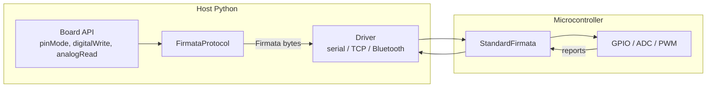

<div align="center">

# liveduino

### A live Python REPL for your board: type a command, watch the hardware react instantly.

[](https://www.python.org/)
[](https://docs.astral.sh/uv/)
[](#prerequisites)
[](#supported-boards)
[](LICENSE)

---

[](https://github.com/adanmauri/liveduino/actions/workflows/tests.yaml)
[](https://github.com/adanmauri/liveduino/actions/workflows/code-quality.yaml)
[](https://github.com/adanmauri/liveduino/actions/workflows/security.yaml)
[](https://github.com/adanmauri/liveduino/actions/workflows/firmware.yaml)
[](https://github.com/adanmauri/liveduino/actions/workflows/publish.yaml)
[](https://github.com/adanmauri/liveduino/actions/workflows/tests.yaml)

---

**The Arduino API you already know, now live, from Python.** Call `pinMode`,
`digitalWrite`, `analogRead` and watch the board react **right away**: no compile, no
upload, no flashing. Just Python talking to real hardware in real time.

It feels like a REPL for your circuit: type a line, the LED blinks; read a pin, the live
value comes back. **The Arduino edit-compile-upload loop is gone.**

**Connect any board, any way.** USB, serial, Bluetooth, Wi-Fi or Ethernet: same code, same
API, just point it at the wire you have. Prototype over USB on your desk, then drive the
exact same board over Wi-Fi from across the room without changing a single line.

> **Not** MicroPython. **Not** a sketch compiler. **Not** yet another pin-object API.
> If you know Arduino, you already know liveduino. There is nothing new to learn.

*The spiritual successor to [Frameduino](https://github.com/adanmauri/frameduino), rebuilt
from scratch for Python 3.13.*

</div>

<br />

## Table of Contents

- [About](#about)
- [Features](#features)
- [Liveduino vs. the alternatives](#liveduino-vs-the-alternatives)
- [Quick start](#quick-start)
- [How it works](#how-it-works)
- [Tech stack](#tech-stack)
- [Arduino API](#arduino-api)
- [Firmware variants](#firmware-variants)
- [Supported boards](#supported-boards)
- [Connections](#connections)
- [Command-line interface](#command-line-interface)
- [Development](#development)
- [Legacy](#legacy)
- [Documentation](#documentation)
- [License](#license)

<br />

## About

Arduino's superpower is its API (`pinMode`, `digitalWrite`, `analogRead`): clean, famous,
and loved by millions. Its workflow, though, is stuck in **batch**: write a sketch, compile
it, upload it, wait, repeat. Every tiny change costs you a full round trip, and you never
get to *talk* to the hardware while it runs.

**liveduino keeps the API and kills the loop.** Your code runs on the **host** and drives
the board live over a wire protocol (StandardFirmata), so every command hits the hardware
the instant you call it. Same function names. Same semantics. Zero new concepts. Now
interactive, scriptable, and powered by Python 3.13.

Prototype faster, debug interactively, automate test rigs, drive sensors and actuators from
your data pipeline, all without leaving Python. This realtime, line-by-line control is the
original [Frameduino](https://github.com/adanmauri/frameduino) vision, rebuilt from scratch
for Python 3.13 and a growing catalog of boards.

> **How it works in one line:** liveduino runs your Python on the computer and speaks to
> firmware already flashed on **your** board. It does not run Python on the chip or compile
> sketches, and that is exactly why it is instant.

<p align="right">(<a href="#table-of-contents">back to top</a>)</p>

## Features

| | |
| --- | --- |
| **Zero learning curve** | If you know Arduino, you are already done. Same names, same semantics, in Python |
| **Instant feedback** | Every `digitalWrite` / `analogRead` fires on the board *now*: no compile, no upload, no wait |
| **Real device coverage** | Digital I/O, analog input, PWM, **servo**, and **I2C** (sensors, displays, ...) — all over the bundled StandardFirmata, no extra firmware |
| **No dependency bloat** | Native StandardFirmata 2.x, written in-house. No third-party Firmata library to drag along |
| **No Arduino IDE** | Flashes StandardFirmata itself in pure Python over the bootloader; no IDE, no avrdude, no toolchain |
| **Connect any way** | One API over USB serial, Wi-Fi/Ethernet (TCP), or Bluetooth RFCOMM; just swap the driver |
| **Batteries-included catalog** | Auto-discovered profiles for UNO, Nano, Mini, Pro Mini, Fio, and more; add a board by dropping a file |
| **Typed and safe** | `Literal` types (`PinMode`, `DigitalValue`, `BitOrder`) with pins, modes, and values validated before they hit the wire |
| **Rock-solid** | 100% unit-test coverage with mocks, plus real-hardware integration tests |

<p align="right">(<a href="#table-of-contents">back to top</a>)</p>

## Liveduino vs. the alternatives

Others make you learn a new API or a new language. liveduino bets on the one you already
know.

| | liveduino | pyFirmata / Telemetrix | MicroPython |
| --- | --- | --- | --- |
| **API style** | Arduino/Wiring (`pinMode`, `digitalWrite`) | Library-specific | Python on device |
| **Code runs on** | Host Python | Host Python | Microcontroller |
| **Firmware** | StandardFirmata | Firmata / custom | MicroPython |
| **Flashing** | Built in, pure Python (no Arduino IDE) | Arduino IDE / avrdude | esptool / external tool |
| **Learning curve for Arduino users** | Zero | New API | New language |

<p align="right">(<a href="#table-of-contents">back to top</a>)</p>

## Quick start

### Prerequisites

**Host**

| Requirement | macOS | Windows | Linux |
| --- | --- | --- | --- |
| **Python 3.13+** | [python.org](https://www.python.org/downloads/) or `brew install python@3.13` | [python.org](https://www.python.org/downloads/) or `winget install Python.Python.3.13` | Your distro or [python.org](https://www.python.org/downloads/) |

Python 3.13+ is the only thing you need to *use* liveduino. [uv](https://docs.astral.sh/uv/)
is optional (handy if you already use it) and only required to *develop* liveduino.

**Board** (Arduino UNO or compatible)

1. Connect the board via USB.
2. Note its serial port (`/dev/ttyACM0` on Linux, `/dev/cu.usbmodem*` on macOS, `COM3` on Windows). Run `liveduino-cli ports` to list them.

That is it. **No Arduino IDE, no avrdude, no toolchain.** liveduino flashes the firmware
for you in the next step.

### Install

```bash
pip install liveduino
# or
uv add liveduino
```

> Requires **Python 3.13+**.

### Flash the firmware

liveduino ships a prebuilt StandardFirmata image for each board and flashes it over the
serial bootloader itself, in pure Python (it speaks STK500v1 and auto-resets the board via
DTR/RTS). **No Arduino IDE, no avrdude, no `.hex` file, no toolchain.** One command and the
board is ready:

```bash
liveduino-cli flash arduino:uno --port /dev/ttyACM0   # flash bundled StandardFirmata
```

That is the whole setup. The bundled image works offline, and flashing targets the
ATmega328 family (UNO, Nano, Mini, Pro Mini, ...) today. Variants, custom `.hex`, and every
option: [`docs/CLI.md`](docs/CLI.md).

> Already flashed StandardFirmata yourself (e.g. from the Arduino IDE)? Skip this step,
> liveduino talks to whatever StandardFirmata build is already on the board.

### Blink from Python

From zero to a blinking LED in a handful of lines, and it runs the moment you hit enter.

```python
from liveduino import ArduinoUno, OUTPUT, HIGH, LOW

board = ArduinoUno().connect("/dev/ttyACM0")  # or COM3 on Windows
board.pinMode(13, OUTPUT)

while True:
    board.digitalWrite(13, HIGH)
    board.delay(1000)
    board.digitalWrite(13, LOW)
    board.delay(1000)
```

### Read a pin

```python
from liveduino import A0

val = board.analogRead(A0)  # same as analogRead(0); returns 0-1023
board.close()
```

More on analog pins and the full method table: [`docs/API.md`](docs/API.md).

<p align="right">(<a href="#table-of-contents">back to top</a>)</p>

## How it works



You call a plain Python method (`board.pinMode(13, OUTPUT)`); the board validates the pin,
the protocol (*what* is spoken: Firmata) encodes it, and the driver (*where* it connects:
serial, TCP, Bluetooth) ships the bytes. The two layers are decoupled, so a board works over
any channel by swapping the driver, never your code.

Deep dive: [`docs/ARCHITECTURE.md`](docs/ARCHITECTURE.md).

<p align="right">(<a href="#table-of-contents">back to top</a>)</p>

## Tech stack

| Layer | Tools |
| --- | --- |
| **Runtime** | Python 3.13+ |
| **Tooling (dev only)** | [uv](https://docs.astral.sh/uv/) |
| **User API** | `Board` subclasses with camelCase Arduino methods |
| **Protocol** | Native `FirmataProtocol` (StandardFirmata 2.x, stdlib only) |
| **Transport** | [pyserial](https://pyserial.readthedocs.io/) (serial); stdlib sockets (TCP, Bluetooth RFCOMM) |
| **Firmware** | StandardFirmata on the board |
| **Quality** | pytest (100% coverage), ruff, flake8, pylint, mypy, pyright, bandit |

<p align="right">(<a href="#table-of-contents">back to top</a>)</p>

## Arduino API

Public board methods use **camelCase** to match Arduino/Wiring exactly: `pinMode`,
`digitalWrite`, `digitalRead`, `analogRead`, `analogWrite`, `servoWrite`, plus host-side
timing (`delay`, `millis`, ...). Device functions that StandardFirmata cannot perform
(`tone`, `pulseIn`, `shiftOut`/`shiftIn`) exist for fidelity but raise
`UnsupportedOperationError`.

**What works over StandardFirmata today:**

| Capability | Methods | Firmware |
| --- | --- | --- |
| Digital I/O | `pinMode`, `digitalWrite`, `digitalRead` | ✅ built in |
| Analog input | `analogRead` | ✅ built in |
| PWM output | `analogWrite` | ✅ built in |
| **Servo** | `servoWrite`, `servoConfig` | ✅ built in (Servo lib) |
| **I2C** | `i2cConfig`, `i2cWrite`, `i2cRead` | ✅ built in (Wire lib) |
| **Discovery** | `info`, `capabilities`, `pinState`, `status` | ✅ built in (Firmata queries) |
| Host-side timing | `delay`, `delayMicroseconds`, `millis`, `micros` | ✅ host only |
| Tone / pulse / shift | `tone`, `noTone`, `pulseIn`, `shiftOut`, `shiftIn` | ⚠️ raise `UnsupportedOperationError` |

Servo needs no extra setup: `servoWrite(pin, angle)` attaches the servo and moves it (0-180°);
`servoConfig(pin, minPulse, maxPulse)` customises the pulse range first if your servo needs it.

```python
board.servoWrite(9, 90)            # center a servo on pin 9
board.servoConfig(9, 600, 2400)    # optional: set min/max pulse (µs) before writing
```

**I2C** talks to any device on the bus (sensors, OLED displays, RTCs, ...). Call `i2cConfig`
once to enable the bus, then `i2cWrite` / `i2cRead`:

```python
board.i2cConfig()                       # enable the I2C bus (once)
board.i2cWrite(0x68, [0x6B, 0x00])      # wake an MPU-6050 (write 0x00 to register 0x6B)
data = board.i2cRead(0x68, 6, register=0x3B)  # read 6 bytes starting at register 0x3B
```

> **Not identical to Arduino's `Wire`.** liveduino exposes a higher-level, batched I2C API
> over Firmata rather than the stateful `Wire` object. The mapping is direct:
>
> | Arduino `Wire` | liveduino |
> | --- | --- |
> | `Wire.begin()` | `board.i2cConfig()` |
> | `Wire.beginTransmission(a)` + `write(...)` + `endTransmission()` | `board.i2cWrite(a, [...])` |
> | `Wire.requestFrom(a, n)` + `read()` | `board.i2cRead(a, n)` |
> | register read (`write(reg)` then `requestFrom`) | `board.i2cRead(a, n, register=reg)` |
>
> Other Arduino calls (`pinMode`, `digitalWrite`, `analogRead`, `servoWrite`) keep the exact
> Arduino name and semantics; I2C differs because Arduino models it as an object, not free
> functions.

Prefer the literal Arduino `Wire` calls? `board.wire` mirrors them line for line. Alias it
once (`Wire = board.wire`, standing in for `#include <Wire.h>`) and the rest is identical to
an Arduino sketch:

```python
Wire = board.wire          # in place of: #include <Wire.h>

Wire.begin()
Wire.beginTransmission(0x68)
Wire.write(0x3B)
Wire.endTransmission()
Wire.requestFrom(0x68, 6)
while Wire.available():
    value = Wire.read()
```

**Discovery** lets you ask a connected board about itself, instead of trusting the catalog:

```python
board.info()            # firmware name/version + board identity
board.pinState(13)      # a pin's live mode (by name) and value
board.status()          # snapshot of every pin
board.capabilities()    # per-pin modes: read from the firmware once (cached), else the catalog
```

Full method table, analog pin model, and the `map_range` / `constrain` helpers:
[`docs/API.md`](docs/API.md).

<p align="right">(<a href="#table-of-contents">back to top</a>)</p>

## Firmware variants

The Firmata family ships several firmware sketches. liveduino bundles and flashes
**StandardFirmata** by default (it covers digital/analog I/O, PWM, and servo on a plain
USB-serial board) and also bundles **StandardFirmataEthernet** for the Ethernet board. Here
is how they compare, so you know what each one buys you:

| Firmware | Transport | Digital/Analog/PWM | Servo | Extra | liveduino |
| --- | --- | --- | --- | --- | --- |
| **StandardFirmata** | Serial | ✅ | ✅ | — | ✅ default |
| **StandardFirmataPlus** | Serial | ✅ | ✅ | I2C, OneWire, stepper, frequency | not bundled |
| **StandardFirmataEthernet** | Ethernet (TCP) | ✅ | ✅ | network transport | ✅ bundled extra |
| **StandardFirmataWiFi** | Wi-Fi (TCP) | ✅ | ✅ | needs `wifiConfig.h` | not bundled |
| **StandardFirmataBLE** | Bluetooth LE | ✅ | ✅ | needs BLE config | not bundled |
| **ConfigurableFirmata** | Serial / net | ✅ | ✅ | modular: DHT, stepper, I2C, SPI, encoder | not bundled |

liveduino's client speaks the base Firmata 2.x wire protocol, which all of these share for
core I/O and servo, so it can talk to any StandardFirmata build already on your board. The
richer variants (Plus / ConfigurableFirmata) add features that need extra client support
before liveduino can drive them.

<p align="right">(<a href="#table-of-contents">back to top</a>)</p>

## Supported boards

Arduino UNO is fully supported (StandardFirmata over USB serial). Nano, Mini, Pro Mini, Fio,
Duemilanove/Diecimila, Ethernet, BT, LilyPad, and UNO Mini are supported; Mega, Leonardo,
Micro, and Pinguino are planned. Board profiles are auto-discovered, so adding one is just
dropping a file.

```python
from liveduino import connect

board = connect("arduino:uno", "/dev/ttyACM0")
```

Full board table and how to add a board: [`docs/BOARDS.md`](docs/BOARDS.md).

<p align="right">(<a href="#table-of-contents">back to top</a>)</p>

## Connections

**One API, every wire.** Liveduino implements StandardFirmata natively over a pluggable
**driver** (the channel), so the same board, the same code, and the same Arduino calls run
over whatever connection you have. Start over USB on your desk, move to Wi-Fi across the
room, or go wireless over Bluetooth: you swap one line, never your code.

| Connection | When to reach for it | How |
| --- | --- | --- |
| **USB / serial** | Plug-and-play on your desk, the default | `.connect("/dev/ttyACM0")` |
| **Wi-Fi / Ethernet (TCP)** | Drive a board anywhere on the network | `.connect(driver=TcpDriver(host, port))` |
| **Bluetooth (RFCOMM)** | Cut the cord and go wireless | `.connect(driver=BluetoothDriver(...))` |

```python
from liveduino import ArduinoUno, TcpDriver

board = ArduinoUno().connect("/dev/ttyACM0")                          # USB serial (default)
board = ArduinoUno().connect(driver=TcpDriver("192.168.1.50", 3030))  # Wi-Fi / Ethernet
```

Every driver and the protocol override: [`docs/CONNECTIONS.md`](docs/CONNECTIONS.md).

<p align="right">(<a href="#table-of-contents">back to top</a>)</p>

## Command-line interface

Installing liveduino adds the `liveduino-cli` console command, pure Python with no extra
toolchain:

```bash
liveduino-cli flash arduino:uno --port /dev/ttyACM0   # flash bundled StandardFirmata (STK500v1)
liveduino-cli boards                                  # list catalog boards
liveduino-cli ports                                   # list serial ports
```

Full reference: [`docs/CLI.md`](docs/CLI.md).

<p align="right">(<a href="#table-of-contents">back to top</a>)</p>

## Development

Requires Python 3.13 and [uv](https://docs.astral.sh/uv/).

```bash
uv python pin 3.13
uv sync --all-groups
make install-dev        # installs dev deps + pre-commit hooks
make check              # lint + type-check + 100% coverage gate
```

Every `make` target, the coverage gate, and how to run hardware integration tests:
[`docs/DEVELOPMENT.md`](docs/DEVELOPMENT.md).

<p align="right">(<a href="#table-of-contents">back to top</a>)</p>

## Legacy

Frameduino 0.x (Python 2, Pinguino-only) lives in the original
[Frameduino](https://github.com/adanmauri/frameduino) repository.

<p align="right">(<a href="#table-of-contents">back to top</a>)</p>

## Documentation

| Document | Audience | Contents |
| --- | --- | --- |
| **This README** | Everyone | Motivation, quick start, overview |
| [`docs/API.md`](docs/API.md) | Users | Full Arduino method table and analog pin model |
| [`docs/BOARDS.md`](docs/BOARDS.md) | Users | Supported boards and how to add one |
| [`docs/CONNECTIONS.md`](docs/CONNECTIONS.md) | Users | Drivers (serial, TCP, Bluetooth) and protocol override |
| [`docs/CLI.md`](docs/CLI.md) | Users | `liveduino-cli` command: flash firmware, list boards and ports |
| [`docs/DEVELOPMENT.md`](docs/DEVELOPMENT.md) | Contributors | Setup, `make` targets, and tests |
| [`docs/ARCHITECTURE.md`](docs/ARCHITECTURE.md) | Contributors | Layers, data flow, drivers, analog pins, testing |
| [`firmware/arduino/README.md`](firmware/arduino/README.md) | Users | StandardFirmata setup and serial settings |
| [`AGENTS.md`](AGENTS.md) | AI agents | Coding standards and guardrails |

<p align="right">(<a href="#table-of-contents">back to top</a>)</p>

## License

Distributed under the [MIT License](LICENSE).

<p align="right">(<a href="#table-of-contents">back to top</a>)</p>
